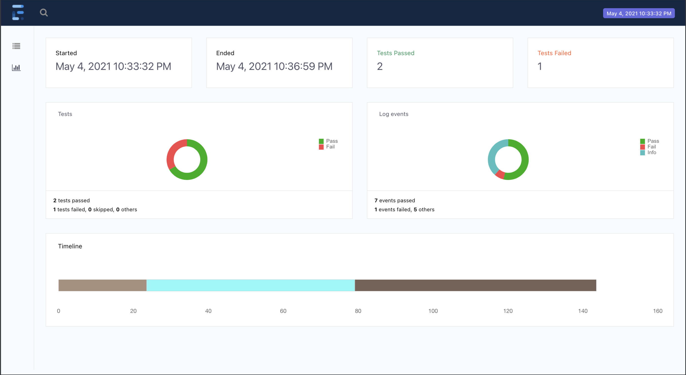
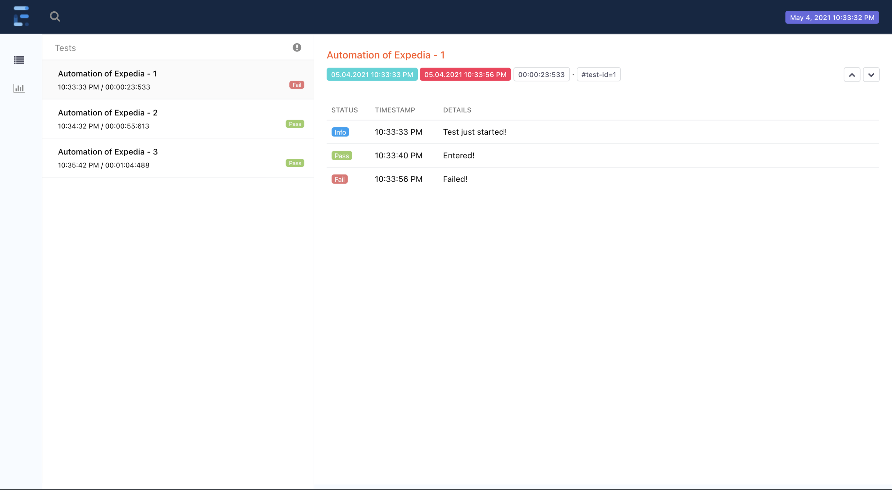

# Automation of Expedia application in Java and integrating the same with Extent Reports.
<br/>

#  :radio_button:  Prerequisites

### a. Installing JDK and initialising $JAVA_HOME:
1. Download JDK from the link: [https://www.oracle.com/in/java/technologies/javase/javase-jdk8-downloads.html](https://www.oracle.com/in/java/technologies/javase/javase-jdk8-downloads.html) and install it.
2. Now the environmental variable JAVA_HOME should be initialised.

Now initialising the $JAVA_HOME variable. This can be done by executing the below commands.

```
nano .zprofile
export JAVA_HOME = "$(/usr/libexec/java_home)"
```

Example

```
# Setting PATH for Python 3.9
# The original version is saved in .zprofile.pysave
export JAVA_HOME="/Library/Java/JavaVirtualMachines/jdk-
11.0.10.jdk/Contents/Ho$
```

### b. Installing Appium Desktop App:
1. Download the Appium Desktop app from the link: [https://appium.io/downloads.html](https://appium.io/downloads.html) and install it.
This can be used to create the automation script.

### c. Installing Code Editor:

1. Download IntelliJ IDEA code from the link: [https://www.jetbrains.com/idea/download/](https://www.jetbrains.com/idea/download/)
and install it.

**Any other code editor can also be used.**

**Once all the above steps are completed, the setup is ready.**

<br/>

# :radio_button: Test Flow <a name = "tf"></a>

Three tests are executed in a single session, with one session designated to fail and the other two to pass.

### Test case 1( Fail session )
This test case validates the functionality of login the Expedia application. It covers the following steps:
1. Launch Expedia application.
2. Clear the initals  popup navigate to login page 
3. Fail at Finding Gamil option for login. 

### Test case 2 and Test case 3( Pass session )
This test case validates the functionality of login the Expedia application. It covers the following steps:
1. Launch Expedia application.
2. Clear the initals  popup navigate to login page 
3. Find Gmail option to login and click 
4. Select the gmail account for login 
5. Verify the login with element on Home page 

<br/>

# :radio_button: Test Execution

- Open **`appiumtests`** Directory in IntelliJ (File -> Open -> Select Directory )  

-  Update the device id and Appium url  of the device which your performing the test  in **`BaseClass.java`** (path : `appiumtests/src/test/java/in/maven/tests` ) .

- Execut the test file . ( right click on Tests.java -> Run 'Tests' )

-  Now if you execute the automation test code, a HTML report will be created in the path you have specified in the above code. In my case the report will be generated in the same directory (target directory)and will be named as **`Spark.html`**.





This will be the end product. This is how the report will be generated after the test is executed.
