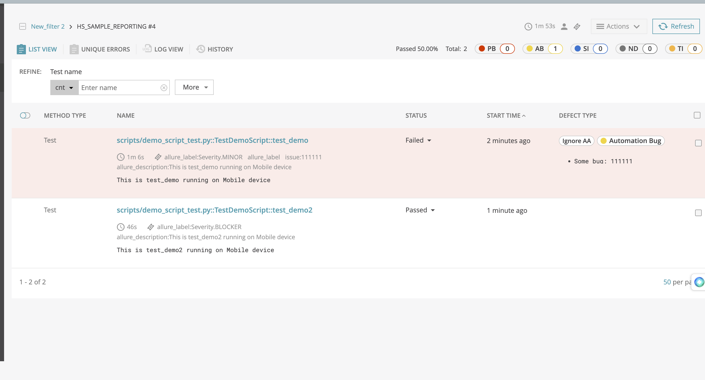
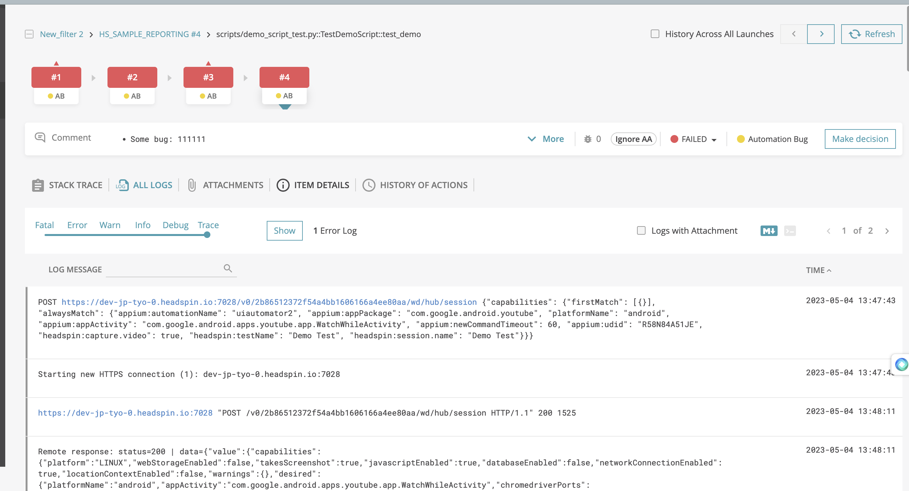

# Pytest Reporting Tools

This is a Pytest sample project, which uses different Reporting Tools.


## 📝 Table of Contents

- [Requirements](#req) 
- [Pytest HTML Report](#phr)
- [Allure Reporting](#ar)
- [Report Portal](#rp)
- [Reference](#reference)

# :ballot_box_with_check: Requirements<a name = "req"></a>

1.  Device Platfrom  - Andoid 
2.  Test Application  - Youtube 


3.  Python  - Version 3.8 or above 
4.  Install all python packages before executing to avoid import errors.


		#Execute from Pytest_reports Directory 
		pip3 install -r requirements.txt

5.   Run Test from  **`Pytest_reports`** Directory .

6.  For Running the test with  Local Appium Server
	- Install and Setup the Appium Server in  the local  ( [Installation Setp ](https://appium.io/docs/en/2.0/quickstart/install/)) , Start the server with command `appium` and get the Appium url. (Example url : `http://0.0.0.0:4723/wd/hub` )
	-  Make device available locally and get the device id with command `adb dveices`

  	 	*Note : All Headspin Capabilities will be disabled while running test on local appium server* 


**Note**  :

-  To perform the Test Setup on Linux and Mac OS, you can run the `setup.sh` bash script located in the root directory. The script carries out the subsequent actions:

	- Verify whether python3 is pre-installed or not, and if it is not installed, proceed with its installation.
	- Set up a python virtual environment named **`env3`** and install all the necessary python packages within it.
	- Verify whether allure is pre-installed or not, and if it is not installed, proceed with its installation.   
-  To run the **`setup.sh`** bash script, it is necessary to grant executable permission by using the command **`chmod +x setup.sh`** beforehand.
- Execute the setup.sh with command :  **`bash setup.sh`**  
- python virtual environment can be activate with the command : **`source env3/bin/activate `**

# :radio_button: Pytest HTML Report <a name = "phr"></a>
pytest-html is a plugin for pytest that generates an HTML report for test results. The report generated by this plugin is html file which can be opened with any browser. 

### Installation 
*`Note :  Skip this steps if initail setup is already  done with setup.sh or requirements.txt`* 


```
 pip3 install pytest-html
```

### Run Script with HTML Report

In this project, a custom **`--html_report`** command line argument was created. Setting it to *`true`* generates a self-contained HTML report, and any other value (such as *`false`*) skips generating the report.

Pytest HTML Report can be generated using the command line argument **`--html_report true`**

```
pytest scripts/demo_script_test.py --udid <device_id> --appium_url <headspin_appium_url/local_appium_url> --html_report true 
```

Once the execution is completed the generated report will be available on the **`html_reports`**   directory.

### Add logs to HTML Report
Use the below command line argument while executing the test to add logs to the HTML Report.

`--capture=tee-sys`

### Pytest HTML Report Sample

### HTML Report Enhancing
Pytest HTML Report can be enhanced using different hooks provided by the pytest and pytest-html plugin. The **`conftest.py`** file contains examples for the below-listed hooks

1. By default the report title will be the filename of the report, you can edit it by using the **`pytest_html_report_title`** hook.
2. Environment table in html report can be modified using **`pytest_sessionfinish`** hook.
3. We can add prefix, summary and postfix messages in the summary section of the html report by using **`pytest_html_results_summary`** hook.
4. We can add or remove results table header using the **`pytest_html_results_table_header`** hook.
5. We can add or remove results table row using the **`pytest_html_results_table_row`** hook.
6. We can add additional information(screenshots, logs, etc) to the table extra section using **`pytest_runtest_makereport`**, **`pytest_html_results_table_html`** hooks.

# :radio_button: Allure Reporting <a name = "ar"></a>

Allure is a powerful reporting framework for test automation that provides detailed and comprehensive reports in a user-friendly format. In this README, we will go through the steps to create an Allure report for Pytest.


### **Installation** 

 To use Allure pytest report, you first need to install both allure and allure-pytest. The allure and allure-pytest can be installed by running the following command:

*`Note :  Skip this steps if initail setup is already  done with setup.sh`* 

#### 1.  Allure Command-Line Tool

 - Installing Allure on macOS

  	- Install Homebrew package manager (if not already installed): 

		  /bin/bash -c "$(curl -fsSL https://raw.githubusercontent.com/Homebrew/install/HEAD/install.sh)"

 	 - Install Allure: 

		   brew install allure

  - Installing Allure on Linux
  	- Update your package manager: 

        	sudo apt-get update
  
  	- Install Allure: 

			sudo apt-add-repository ppa:qameta/allure
			sudo apt-get update 
			sudo apt-get install allure
 

- Installing Allure on Windows
		
	- Install Scoop package manager (if not already installed):

	       Set-ExecutionPolicy RemoteSigned -scope CurrentUser
		   iwr -useb get.scoop.sh | iex

	- Install Allure:
		
		  scoop install allure
 
#### 2. Install allure-pytest :
	
	
```
 #Skip this steps if initail setup is already  done with setup.sh or requirements.tx
 pip3 install allure-pytest

```


### Run Script with Allure Report

The pytest sample scripts can be executed from the root(Pytest_reports) directory using the run command.

```
pytest scripts/demo_script_test.py --udid <device_id> --appium_url <headspin_appium_url/local_appium_url> --allure_report true 
```


- This will generate test results in the specified directory in an XML.

  - **`allure serve allure-report/allure-results`**
  Executing  this command from root(Pytest_reports) will start a web server and open the Allure Report in your default web browser.

### Allure Report Samples


# :radio_button: Report Portal <a name = "rp"></a>
Report Portal is an open-source reporting platform designed for software testing that allows users to store, organize, and analyze their test results in a centralized location. It provides a web-based interface that enables users to create and manage test plans, execute tests, and view test results in real-time.


- ###  Installation

*`Note :  Skip this steps if initail setup is already  done with setup.sh or requirements.txt`* 

```
   pip3 install reportportal-client
   pip3 install pytest-reportportal
```


- ### Steps to set up ReportPortal with Pytest:

  1. Install ReportPortal using Docker or the Set Account in ReportPortal.io. ( Website Link :  [ReportPortal.io](https://reportportal.io/) )
  2. Set up a new project in ReportPortal.
  3. Install the ReportPortal client for Python using pip3.
  4. Configure your Pytest project to report to ReportPortal by adding the following  [configurations](#conf)  in pytest.ini 
  5. Run your Pytest test suite and view the results in the ReportPortal dashboard.


- ### Configuration<a name = "conf"></a>

  The config file pytest.ini is in root directory of tests . The pytest.ini file have following parameters to set   : 

	*   **`rp_uuid`**: value could be found in the User Profile section (Access Token) 
	*   **`rp_project`**: name of project in Report Portal
	*   **`rp_endpoint`**: address of Report Portal Server
	*   **`rp_launch`**: AnyLaunchName - launch name (could be overridden by pytest --rp-launch option, default value is 'Pytest Launch')
	*   **`rp_launch_attributes`**: 'PyTest' 'Smoke' 'Env:Python3' - list of attributes for launch
	*   **`rp_tests_attributes`**:'PyTest' 'Smoke' - list of attributes that will be added for each item in the launch

  
	**Note** :

	 - **`rp_uuid`**: As we are using a Demo account to view the test report, there is a possibility that the token may change. Therefore, before running the tests, ensure that the latest generated token is being used, which can be found in the profile section .If the default token has been changed, please update it with the latest token before running the tests. Account Link  : [Demo Account User Profile ](https://demo.reportportal.io/ui/#user-profile)
	
	-  If you like to override the above parameters from command line, or from CI environment based on your build, then pass : **`-o "rp_launch_attributes=Smoke Tests"`** during invocation.*

- ### Run Script with ReportPortal 

  To Enable the Report Portal add --reportportal to the run command during the invocation from the root(Pytest_reports) directory. 
```
pytest scripts/demo_script_test.py --udid <device_id> --appium_url <headspin_appium_url/local_appium_url> --reportportal
```
- ### Test Report  Visualisation 

  *  Test ran with the default pytest.ini conf deatils can be visualised in Demo Dashboard of ReportProtal  .

  *    TestPortal Demo Account : [Demo Account Link ](https://demo.reportportal.io/ui/#default_personal/launches/19)
  
  * Test Reports on Demo ReportProtal Account will be flushed in every 18hours , Data will be flushed in 18 hours . 

   *Note : By clicking on the login button, you can access Demo account as Demo  login credentials will already be saved.*

### Report Portal Samples





#  :books: Reference <a name = "reference"></a>
* Pytest HTML - [https://pytest-html.readthedocs.io/en/latest/index.html](https://pytest-html.readthedocs.io/en/latest/index.html)
* Report portal python client - [https://pypi.org/project/reportportal-client/](https://pypi.org/project/reportportal-client/)
* Pytest Allure - [https://docs.qameta.io/allure/#_pytest](https://docs.qameta.io/allure/#_pytest)


